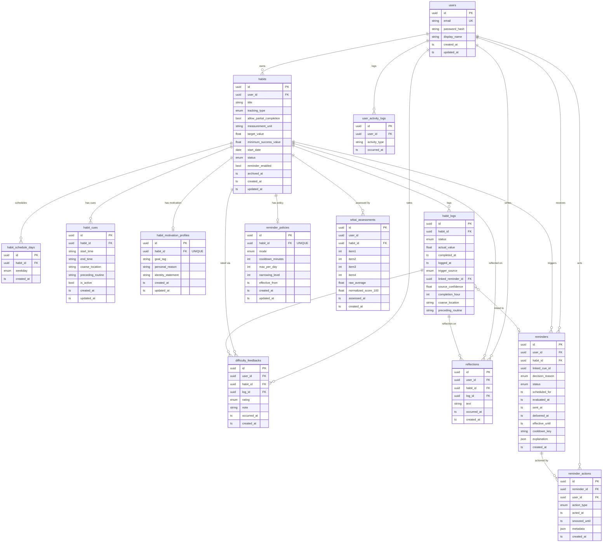

# Habit System — Backend Архитектур

> **Thesis demo · 2026 Spring**
> NestJS v11 · TypeScript · Prisma v7 · PostgreSQL

---

## 1. Технологийн Stack

| Давхарга | Технологи |
|---|---|
| Framework | NestJS v11 (Node.js v22) |
| Хэл | TypeScript 5 + SWC |
| ORM | Prisma v7 |
| Мэдээллийн сан | PostgreSQL |
| Баталгаажуулалт | JWT + Passport |
| Тест | Jest (52 тест, 8 suite) |

---

## 2. Давхаргат Бүтэц

```
┌──────────────────────────────────────────────────────────────┐
│                    HTTP / REST API                           │
│             (Controllers + DTOs + Guards)                    │
├──────────────────────────────────────────────────────────────┤
│                 APPLICATION SERVICES                         │
│   AuthService · HabitsService · SrbaiService                │
│   ProgressService · FeedbackService                         │
│   ReminderExecutionService · RemindersService               │
├──────────────────────────────────────────────────────────────┤
│                    DOMAIN LAYER                              │
│   Entities (12) · Repository Interfaces (10)                │
│   Domain Rules (4 файл)                                     │
├──────────────────────────────────────────────────────────────┤
│                INFRASTRUCTURE LAYER                          │
│   Prisma Repositories (10) · PrismaService                  │
├──────────────────────────────────────────────────────────────┤
│                     DATABASE                                 │
│                    PostgreSQL                                │
└──────────────────────────────────────────────────────────────┘
```

---

## 3. Модулийн Диаграм

```
                    ┌─────────────────────────┐
                    │  PrismaModule (Global)  │
                    │  PrismaService          │
                    └───────────┬─────────────┘
                                │ (inject)
         ┌──────────────────────┼──────────────────────┐
         ▼                      ▼                      ▼
  ┌─────────────┐      ┌──────────────────┐   ┌──────────────────┐
  │  AuthModule │      │  AnalyticsModule │   │  (root feature)  │
  │  AuthService│      │  AnalyticsService│   │  AppModule       │
  │  JwtStrategy│      │  UserActivityLog │   └──────────────────┘
  └──────┬──────┘      └────────┬─────────┘
         │                      │
         └──────────┬───────────┘
                    ▼
         ┌──────────────────────┐
         │    HabitsModule      │
         │  HabitsService       │
         │  SrbaiService        │
         │  HABIT_REPOSITORY    │
         │  HABIT_LOG_REPO      │
         │  SRBAI_ASSESSMENT    │
         │  REMINDER_POLICY     │
         └──────────┬───────────┘
              │     │
    ┌──────────┘     └──────────┐
    ▼                           ▼
┌──────────────────┐   ┌──────────────────────┐
│  ProgressModule  │   │   RemindersModule    │
│  ProgressService │   │  ReminderExecution   │
│  FeedbackService │   │  RemindersService    │
│  HABIT_LOG_REPO  │   │  REMINDER_REPO       │
│  DIFFICULTY_REPO │   │  REMINDER_ACTION     │
│  REFLECTION_REPO │   │  REMINDER_POLICY     │
│  REMINDER_POLICY │   │  NotificationGateway │
└──────────────────┘   └──────────────────────┘
```

---

## 4. Domain Layer — Entities (12)

```
domain/entities/
├── user.entity.ts               ─── Хэрэглэгч (id, email, passwordHash)
├── habit.entity.ts              ─── Дадлага (гол aggregate root)
├── habit-schedule-day.entity.ts ─── Дадлагын өдрийн хуваарь (Mon–Sun)
├── habit-cue.entity.ts          ─── Орчны cue (цаг, байршил, routine)
├── motivation-profile.entity.ts ─── Зорилго, шалтгаан, identity
├── habit-log.entity.ts          ─── Гүйцэтгэлийн бүртгэл
│                                     completionHour / coarseLocation
│                                     precedingRoutine (контекст)
├── difficulty-feedback.entity.ts─── Хэцүүдлийн үнэлгээ (4C)
├── reflection.entity.ts         ─── Тусгал бичлэг (4C)
├── srbai-assessment.entity.ts   ─── SRBAI дүн (4B)
├── reminder.entity.ts           ─── Сануулга (cooldownKey / effectiveUntil)
├── reminder-action.entity.ts    ─── Хэрэглэгчийн хариу (DONE/SNOOZE)
└── reminder-policy.entity.ts    ─── Tapering бодлого (4B)
```

---

## 5. Domain Layer — Rules (Domain Logic)

```
domain/rules/
│
├── cue-schedule.rules.ts
│   └── CueScheduleRules.evaluateCue()
│       Орчны cue идэвхтэй эсэхийг цаг, байршил, routine-ээр тодорхойлно
│
├── reminder-decision.rules.ts
│   └── ReminderDecisionRules.decide()
│       Сануулга илгээх эсэхийг тодорхойлно:
│       reminderEnabled? → isScheduledToday? → hasActiveCues?
│
├── habit-strength.rules.ts
│   ├── HabitStrengthRules.compute()         → сигналууд
│   ├── HabitStrengthRules.scoreSrbai()      → SRBAI нормчлол
│   ├── HabitStrengthRules.computeComposite()→ нийлмэл оноо (0–100)
│   └── HabitStrengthRules.computeContextStability()
│       → сүүлийн 20 гүйцэтгэлийн цаг/байршил/routine-ын modal rate
│
└── adaptation.rules.ts
    └── AdaptationRules.recommend()
        compositeScore + selfInitiatedRate + recentDifficulty
        → focus: reduce_reminders | maintain | increase_support
              | review_difficulty | celebrate_consistency
```

---

## 6. Repository — Ports & Adapters

```
DOMAIN PORT (interface)          INFRA ADAPTER (Prisma)
─────────────────────────────────────────────────────────
IUserRepository              ←─── UserPrismaRepository
IHabitRepository             ←─── HabitPrismaRepository
IHabitLogRepository          ←─── HabitLogPrismaRepository
IDifficultyFeedbackRepository←─── DifficultyFeedbackPrismaRepository
IReflectionRepository        ←─── ReflectionPrismaRepository
IReminderRepository          ←─── ReminderPrismaRepository
IReminderActionRepository    ←─── ReminderActionPrismaRepository
IReminderPolicyRepository    ←─── ReminderPolicyPrismaRepository
ISrbaiAssessmentRepository   ←─── SrbaiAssessmentPrismaRepository
IUserActivityLogRepository   ←─── UserActivityLogPrismaRepository

NestJS DI: { provide: HABIT_REPOSITORY, useClass: HabitPrismaRepository }
```

---

## 7. REST API Endpoint-ууд

### Auth — `/auth`
| Method | URL | Тайлбар |
|---|---|---|
| POST | `/auth/register` | Бүртгэл |
| POST | `/auth/login` | Нэвтрэх → JWT |

### Habits — `/users/:userId/habits`
| Method | URL | Тайлбар |
|---|---|---|
| POST | `/habits` | Дадлага үүсгэх |
| GET | `/habits` | Жагсаалт |
| GET | `/habits/:habitId` | Дэлгэрэнгүй |
| PATCH | `/habits/:habitId` | Засах |
| POST | `/habits/:habitId/cues` | Cue нэмэх |
| POST | `/habits/:habitId/schedule` | Хуваарь нэмэх |
| POST | `/habits/:habitId/motivation` | Мотивацийн профайл |
| POST | `/habits/:habitId/srbai` | SRBAI дүн оруулах |
| GET | `/habits/:habitId/composite-score` | Нийлмэл оноо авах |

### Progress — `/users/:userId/habits/:habitId`
| Method | URL | Тайлбар |
|---|---|---|
| POST | `/logs` | Гүйцэтгэл бүртгэх |
| GET | `/logs` | Бүртгэлийн жагсаалт |
| GET | `/progress-summary` | Явц хураангуй |
| GET | `/habit-strength` | Хүч сигналууд |
| POST | `/logs/:logId/difficulty` | Хэцүүдлийн үнэлгээ |
| GET | `/difficulty-ratings` | Үнэлгээний жагсаалт |
| POST | `/logs/:logId/reflection` | Тусгал бичих |
| GET | `/adaptation-recommendation` | **Серверт тооцоолсон зөвлөмж** |

### Reminders — `/users/:userId/habits/:habitId`
| Method | URL | Тайлбар |
|---|---|---|
| POST | `/reminders/evaluate` | Сануулга үнэлж илгээх |
| POST | `/reminders/:id/actions` | DONE / SNOOZE |
| GET | `/reminders` | Сануулгын жагсаалт |

### Analytics — `/users/:userId/activity`
| Method | URL | Тайлбар |
|---|---|---|
| GET | `/activity` | Үйл ажиллагааны лог жагсаалт |

---

## 8. Database Schema — ERD (Mermaid)



---

## 9. Сануулгын Dedup Механизм

```
evaluateAndCreate(userId, habitId)
         │
         ▼
  ReminderDecisionRules.decide()
  ├── reminderEnabled? ──No──→ return { persisted: false, REMINDER_DISABLED }
  ├── isScheduledToday? ──No──→ return { persisted: false, NOT_SCHEDULED_TODAY }
  └── hasActiveCues? ──No──→ return { persisted: false, NO_ACTIVE_CUES }
         │ Yes
         ▼
  cooldownKey = `habitId:2026-03-25T14`  ← hourly bucket
         │
         ▼
  findActiveByCooldownKey(key, now)
  ├── found (effectiveUntil > now) ──→ 409 ConflictException
  └── not found
         │
         ▼
  effectiveUntil = now + policy.cooldownMinutes (default 60)
  create Reminder (PENDING)
         │
         ▼
  NotificationGateway.send() → update status SENT
```

---

## 10. Дасан Зохицлын Engine

```
GET /adaptation-recommendation
         │
         ▼
  FeedbackService.getAdaptationRecommendation(userId, habitId)
         │
         ├── SrbaiService.getCompositeScore() ──────────→ compositeScore (0–100)
         │         └── HabitStrengthRules.computeContextStability()
         │               (last 20 logs → modal hour/location/routine)
         │
         ├── habitLogRepo.findSummaryByHabitId() ──→ selfInitiatedRate
         │                                          reminderDependenceRate
         │                                          doneCount
         │
         ├── difficultyRepo.findRecentByHabitId(5) → recentAvgDifficulty
         │
         └── policyRepo.findByHabitId() ────────────→ currentPolicyMode
                   │
                   ▼
         AdaptationRules.recommend(all inputs)
                   │
                   ▼
         { focus, summary, suggestedPolicyMode, milestoneReached }
```

---

## 11. Composite Habit-Strength Оноо

```
finalScore = 0.60 × srbaiScore
           + 0.20 × consistencyScore    (DONE / scheduledDays)
           + 0.10 × selfInitiatedRate   (self-init / total DONE)
           + 0.10 × contextStability    (modal rate: цаг/байршил/routine)

Зэрэглэл:
  ≥ 70  →  ESTABLISHED  (сануулгыг багасгах)
  ≥ 40  →  BUILDING     (үргэлжлүүлэх)
  < 40  →  EARLY_STAGE  (дэмжлэг нэмэх)
```

---

## 12. Тестийн Хамрах Хүрээ

```
Суит                                   Тест
─────────────────────────────────────────────
habit-strength.rules.spec.ts            9 тест
adaptation.rules.spec.ts               11 тест
habits.service.spec.ts                  8 тест
progress.service.spec.ts                8 тест
reminder-execution.service.spec.ts      4 тест
reminders.service.spec.ts               7 тест
dto-validation.spec.ts                  3 тест
app.controller.spec.ts                  2 тест
─────────────────────────────────────────────
Нийт                                  52 тест ✓
```

---

## 13. Эмхэтгэлийн Зураглал

```
src/
├── main.ts                    ← Bootstrap (port 3000)
├── app.module.ts              ← Root module
│
├── auth/                      ← JWT нэвтрэлт
├── analytics/                 ← Үйл ажиллагааны лог
│
├── domain/                    ← Цөм доменын логик
│   ├── entities/  (12)        ← Доменын объектууд
│   ├── repositories/ (10)     ← Interface (port)
│   ├── rules/ (4)             ← Цэвэр домен дүрмүүд
│   └── enums/                 ← Бүх enum-ууд
│
├── habits/                    ← Дадлагын CRUD + SRBAI
├── progress/                  ← Гүйцэтгэл, дасан зохицол
├── reminders/                 ← Сануулга + notification
│
└── infrastructure/
    ├── prisma/                ← PrismaService (global)
    └── persistence/ (10)      ← Prisma adapter (port ↔ adapter)
```
